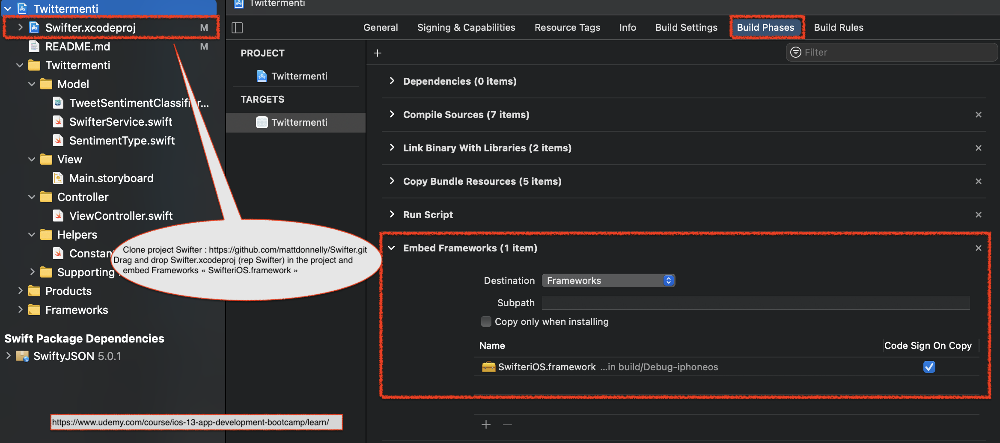

#  Twittermenti

  

Section 26: CreateML & Natural Language Processing (NLP)

>This is a companion project to The App Brewery's Complete App Developement Bootcamp, check out the full course at [www.appbrewery.co](https://www.appbrewery.co/)

---

### Fonctionnalités :

Pour l'utilisation de ce projet merci de télécharger le fichier **TweetSentimentClassifier.mlmodel** avec le lien suivant :

Fichier CoreML :
https://storage.googleapis.com/images-angelappdev/CoreML/TweetSentimentClassifier.mlmodel

### Features :

To use this project, please download the **TweetSentimentClassifier.mlmodel** file with the following link:

CoreML file:
https://storage.googleapis.com/images-angelappdev/CoreML/TweetSentimentClassifier.mlmodel

---

#### Twitter API :

https://developer.twitter.com/en/docs/twitter-api/v1/tweets/search/api-reference/get-search-tweets

#### Swifter :

Clone project "Swifter" from GitHub => https://github.com/mattdonnelly/Swifter.git
Add to project => Drag and drop ***Swifter.xcodeproj*** (rep Swifter) in the project and embed Frameworks ***« SwifteriOS.framework »***

>__Setting Up the Swifter Framework :__
>  1. https://www.udemy.com/course/ios-13-app-development-bootcamp/learn/lecture/16828294#questions
 > 2. https://www.udemy.com/course/ios-13-app-development-bootcamp/learn/lecture/16828296#questions

Video : https://www.udemy.com/course/ios-13-app-development-bootcamp/learn/

---